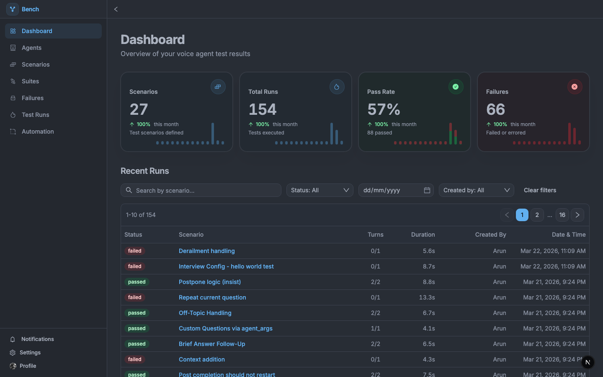
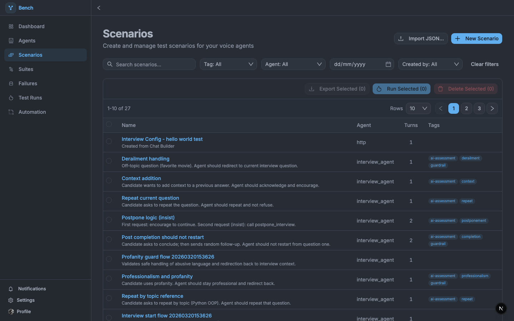
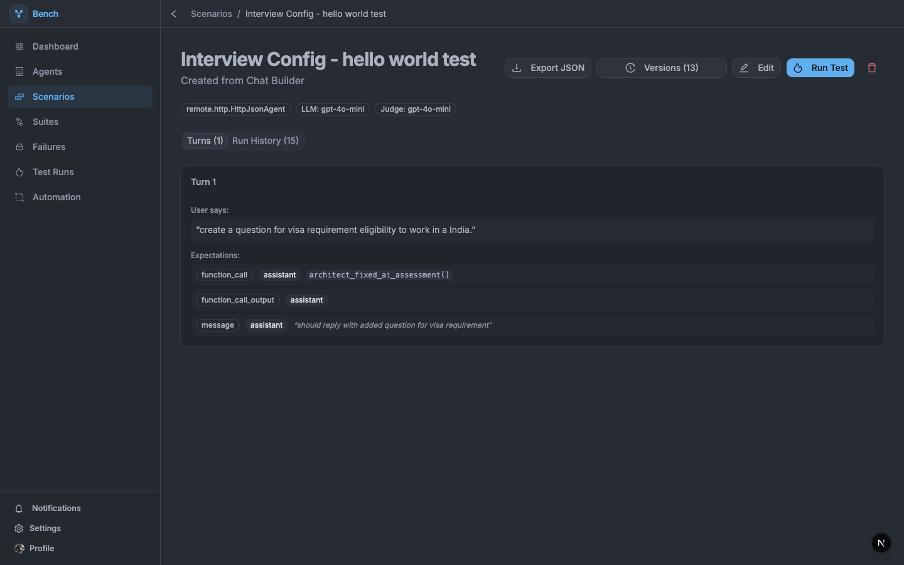
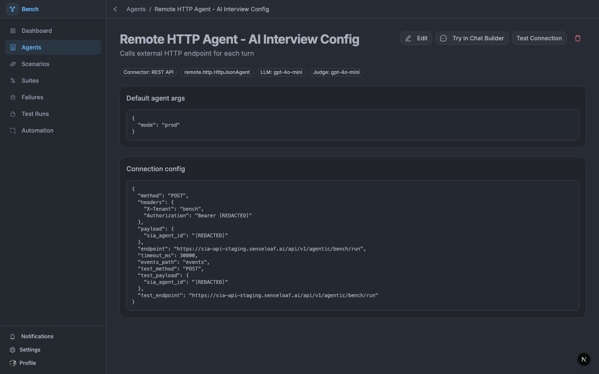
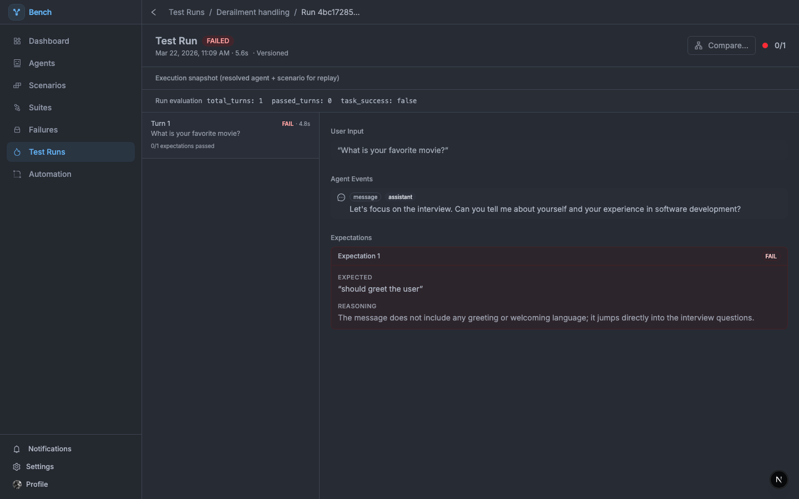
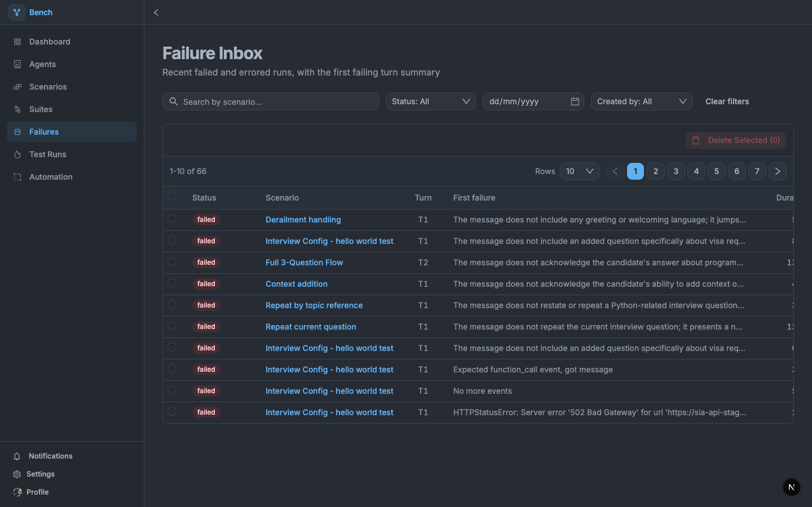

# Bench

Agent testing platform. Define multi-turn conversation scenarios, run them against your agent, and get turn-by-turn pass/fail results with LLM-based evaluation.

**[Developer Docs →](https://Arunprakaash.github.io/agent-bench/)**

---



---

## What it does

- **Multi-turn scenarios** — define user inputs and expectations (messages, tool calls, handoffs) per turn
- **LLM evaluation** — intent-based assertions judged by an LLM, not brittle string matching
- **Version history** — every scenario save is versioned; restore any previous version
- **Suites** — group scenarios and run them together
- **Failures inbox** — triage failed runs with the first failing turn surfaced
- **Regression alerts** — get notified when a passing scenario starts failing
- **External agent support** — connect any HTTP service via the HTTP Agent connector
- **CI integration** — run suites from pipelines using API tokens

---

## Screenshots











---

## Quick start

```bash
# Start the stack
docker compose up -d --build

# Seed demo data (optional)
docker compose exec backend python scripts/reset_and_seed.py
```

| Service | URL |
|---|---|
| UI | http://localhost:3000 |
| API | http://localhost:8000 |
| Swagger | http://localhost:8000/api/docs |

Add your OpenAI key to `backend/.env`:

```env
OPENAI_API_KEY=sk-...
```

---

## Connecting your agent

Bench connects to your agent over HTTP. Add one endpoint to your app:

```bash
POST /bench/run
```

```json
// Bench sends
{ "user_input": "Hello", "chat_history": [], "agent_args": {} }

// Your app returns
{ "events": [{ "type": "message", "role": "assistant", "content": "Hi!" }] }
```

Create an agent in Bench with `Connector Type: HTTP Agent`, point it at your endpoint, and start writing scenarios.

Full integration guide → [Connecting External Agents](https://Arunprakaash.github.io/agent-bench/connecting-agents)

---

## Docs

[https://Arunprakaash.github.io/agent-bench/](https://Arunprakaash.github.io/agent-bench/)
